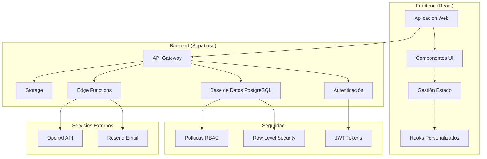

# Documentación Técnica - Sistema Plentum Verify

## Tabla de Contenidos
1. [Documentación del Código](#1-documentación-del-código)
2. [Arquitectura del Sistema](#2-arquitectura-del-sistema)
3. [Guía de Instalación y Despliegue](#3-guía-de-instalación-y-despliegue)

---

## 1. Documentación del Código

### 1.1 Comentarios y Estructura

#### Estructura del Proyecto
```
src/
├── components/           # Componentes React reutilizables
│   ├── auth/            # Autenticación y autorización
│   ├── exam/            # Componentes de exámenes
│   ├── ui/              # Componentes de interfaz (shadcn/ui)
│   ├── user-management/ # Gestión de usuarios
│   └── ...
├── hooks/               # Custom hooks para lógica reutilizable
├── pages/               # Páginas principales de la aplicación
├── utils/               # Utilidades y helpers
├── integrations/        # Integraciones externas (Supabase)
└── lib/                # Configuraciones y utilidades base

supabase/
├── functions/           # Edge Functions de Supabase
└── config.toml         # Configuración de Supabase
```

#### Lógica de Diseño del Código

**Patrón de Componentes:**
- **Composición sobre herencia**: Uso extensivo de composición de componentes React
- **Separación de responsabilidades**: Hooks personalizados para lógica de negocio
- **Tipado estricto**: TypeScript para mayor seguridad de tipos

**Gestión de Estado:**
- **React Query (TanStack Query)**: Cache y sincronización de datos del servidor
- **React Hooks**: Estado local y efectos secundarios
- **Context API**: Estado global (autenticación, configuración del sistema)

**Patrones de Seguridad:**
- **Row Level Security (RLS)**: Implementado en todas las tablas de Supabase
- **Validación de roles**: Funciones de base de datos para verificar permisos
- **Autenticación JWT**: Tokens seguros para autenticación

### 1.2 Dependencias Principales

#### Frontend Dependencies
```json
{
  "@supabase/supabase-js": "^2.50.0",      // Cliente Supabase para interacción con backend
  "@tanstack/react-query": "^5.56.2",      // Cache y sincronización de datos
  "@radix-ui/*": "^1.*",                    // Componentes primitivos accesibles
  "react": "^18.3.1",                      // Biblioteca principal de UI
  "react-router-dom": "^6.26.2",           // Enrutamiento SPA
  "tailwindcss": "*",                       // Framework CSS utility-first
  "zod": "^3.23.8",                        // Validación de esquemas
  "react-hook-form": "^7.53.0",            // Gestión de formularios
  "lucide-react": "^0.462.0",              // Iconos SVG
  "sonner": "^1.5.0",                      // Notificaciones toast
  "recharts": "^2.12.7",                   // Gráficos y visualizaciones
  "papaparse": "^5.5.3",                   // Parser CSV para importación masiva
  "date-fns": "^3.6.0"                     // Manipulación de fechas
}
```

#### Justificación de Dependencias Clave

- **Supabase**: Backend-as-a-Service para autenticación, base de datos PostgreSQL y funciones
- **React Query**: Optimiza el rendimiento con cache inteligente y sincronización automática
- **Radix UI**: Componentes accesibles y sin estilos para máxima personalización
- **Tailwind CSS**: Desarrollo rápido con clases utilitarias y sistema de diseño consistente
- **Zod**: Validación de tipos en runtime para mayor seguridad
- **React Hook Form**: Formularios performantes con validación integrada

### 1.3 APIs y Puntos de Conexión

#### Edge Functions de Supabase

| Función | Método | URL | Descripción | Parámetros |
|---------|--------|-----|-------------|------------|
| `send-exam-invitations` | POST | `/functions/v1/send-exam-invitations` | Envía invitaciones por email | `userEmails[]`, `examId`, `examTitle` |
| `generate-pdf-report` | POST | `/functions/v1/generate-pdf-report` | Genera reportes PDF | `userId`, `examId`, `reportType` |
| `generate-psychometric-analysis` | POST | `/functions/v1/generate-psychometric-analysis` | Análisis IA personalidad | `userId`, `sessionId`, `responses` |
| `generate-statistical-report` | POST | `/functions/v1/generate-statistical-report` | Reportes estadísticos | `examId`, `dateRange`, `filters` |
| `admin-user-management` | POST | `/functions/v1/admin-user-management` | Gestión masiva usuarios | `action`, `userData[]` |
| `session-auth` | POST | `/functions/v1/session-auth` | Autenticación por credenciales | `username`, `password` |

#### Endpoints de la API Supabase (Auto-generados)

**Tablas Principales:**

| Tabla | Operaciones CRUD | Descripción |
|-------|-----------------|-------------|
| `profiles` | SELECT, UPDATE | Perfiles de usuario extendidos |
| `exams` | ALL | Configuración de exámenes |
| `exam_attempts` | SELECT, INSERT, UPDATE | Intentos de examen |
| `questions` | ALL | Preguntas del banco |
| `question_categories` | ALL | Categorías de preguntas |
| `personality_questions` | ALL | Preguntas psicométricas OCEAN |
| `exam_sessions` | ALL | Sesiones de examen activas |
| `psychometric_tests` | SELECT, INSERT | Tests psicométricos configurados |

**Códigos de Respuesta Comunes:**
- `200`: Operación exitosa
- `400`: Error de validación/parámetros
- `401`: No autorizado
- `403`: Sin permisos suficientes
- `404`: Recurso no encontrado
- `500`: Error interno del servidor

---

## 2. Arquitectura del Sistema

### 2.1 Diagrama de Alto Nivel



### 2.2 Tablas de Relación

#### Frontend a Backend
| Componente Frontend | Tabla Supabase | Operación CRUD | Propósito |
|---------------------|----------------|----------------|-----------|
| `UserManagement` | `profiles` | SELECT, UPDATE | Gestión de usuarios |
| `ExamManagement` | `exams` | ALL | Creación y configuración de exámenes |
| `ExamTaking` | `exam_attempts` | INSERT, UPDATE | Registro de intentos |
| `QuestionManagement` | `questions` | ALL | Administración de preguntas |
| `PsychometricTests` | `personality_questions` | SELECT | Carga de preguntas OCEAN |
| `ExamResults` | `exam_attempts`, `personality_results` | SELECT | Visualización de resultados |
| `Analytics` | Multiple tables | SELECT | Dashboards y métricas |

#### Backend a Base de Datos
| Función Backend | Tabla(s) Supabase | Operación | Descripción |
|-----------------|-------------------|-----------|-------------|
| `send-exam-invitations` | `exam_assignments`, `exam_credentials` | INSERT | Crea asignaciones y credenciales |
| `generate-pdf-report` | `exam_attempts`, `profiles` | SELECT | Consulta datos para reporte |
| `session-auth` | `exam_credentials` | SELECT, UPDATE | Valida credenciales de acceso |
| `admin-user-management` | `profiles` | ALL | Operaciones masivas de usuarios |

#### Servicios de Terceros
| Servicio | Función Edge | Propósito | Configuración |
|----------|--------------|-----------|---------------|
| Resend Email | `send-exam-invitations` | Envío de invitaciones | `RESEND_API_KEY` |
| OpenAI API | `generate-psychometric-analysis` | Análisis IA de personalidad | `OPENAI_API_KEY` |

### 2.3 Descripción de la Arquitectura

**Patrón Arquitectónico**: **Jamstack con Backend-as-a-Service**

**Justificación:**
- **Escalabilidad**: Supabase maneja automáticamente el escalado de la base de datos
- **Seguridad**: RLS a nivel de base de datos + autenticación JWT integrada
- **Desarrollo Rápido**: APIs auto-generadas basadas en el esquema de la base de datos
- **Costo-Efectivo**: Pago por uso, ideal para aplicaciones de evaluación

**Componentes Principales:**

1. **Frontend (React SPA)**
   - Aplicación de página única con enrutamiento del lado del cliente
   - Estado global mínimo, preferencia por servidor como fuente de verdad
   - Componentes reutilizables con sistema de diseño consistente

2. **Backend (Supabase)**
   - PostgreSQL con extensiones para funcionalidades avanzadas
   - APIs REST y Realtime auto-generadas
   - Edge Functions para lógica de negocio personalizada

3. **Seguridad Multi-Capa**
   - Autenticación: JWT tokens con renovación automática
   - Autorización: RLS policies basadas en roles
   - Validación: Esquemas Zod en frontend + constrains de DB

**Manejo de Escalabilidad:**
- Cache inteligente con React Query
- Paginación automática para listas grandes
- Índices optimizados en base de datos
- CDN para assets estáticos

---

## 3. Guía de Instalación y Despliegue

### 3.1 Requisitos del Sistema

#### Requisitos de Desarrollo
- **Node.js**: 18.x o superior
- **npm/yarn/bun**: Gestor de paquetes
- **Git**: Control de versiones
- **Editor**: VSCode recomendado con extensiones TypeScript y Tailwind

#### Requisitos de Producción
- **Vercel/Netlify**: Hosting para frontend (recomendado)
- **Supabase**: Cuenta y proyecto activo
- **Dominio**: Opcional para producción

### 3.2 Configuración del Entorno

#### 3.2.1 Base de Datos Supabase

**Paso 1: Crear Proyecto Supabase**
```bash
# Instalar CLI de Supabase
npm install -g supabase

# Inicializar proyecto local
supabase init

# Vincular con proyecto remoto
supabase link --project-ref tu-project-ref
```

**Paso 2: Migrar Esquema de Base de Datos**
```bash
# Aplicar migraciones
supabase db push

# O restaurar desde backup
supabase db reset --db-url "postgresql://..."
```

**Paso 3: Configurar Secretos**
```bash
# Variables de entorno para Edge Functions
supabase secrets set RESEND_API_KEY=tu-resend-key
supabase secrets set OPENAI_API_KEY=tu-openai-key
supabase secrets set SUPABASE_SERVICE_ROLE_KEY=tu-service-role-key
```

#### 3.2.2 Configuración del Código

**Variables de Entorno (.env.local)**
```bash
VITE_SUPABASE_URL=https://tu-proyecto.supabase.co
VITE_SUPABASE_ANON_KEY=tu-anon-key
VITE_SUPABASE_PROJECT_ID=tu-project-id
```

**Instalación de Dependencias**
```bash
# Instalar dependencias
npm install

# Verificar configuración
npm run build
```

### 3.3 Pasos de Despliegue

#### 3.3.1 Entorno de Desarrollo

```bash
# 1. Clonar repositorio
git clone https://github.com/tu-repo/plentum-verify.git
cd plentum-verify

# 2. Instalar dependencias
npm install

# 3. Configurar variables de entorno
cp .env.example .env.local
# Editar .env.local con tus credenciales

# 4. Iniciar Supabase local (opcional)
supabase start

# 5. Ejecutar aplicación
npm run dev
```

#### 3.3.2 Entorno de Producción

**Opción A: Despliegue en Vercel**
```bash
# 1. Instalar Vercel CLI
npm install -g vercel

# 2. Configurar proyecto
vercel

# 3. Configurar variables de entorno en dashboard de Vercel
# - VITE_SUPABASE_URL
# - VITE_SUPABASE_ANON_KEY
# - VITE_SUPABASE_PROJECT_ID

# 4. Desplegar
vercel --prod
```

**Opción B: Despliegue en Netlify**
```bash
# 1. Build de producción
npm run build

# 2. Subir carpeta dist/ a Netlify
# O conectar repositorio Git en dashboard de Netlify

# 3. Configurar variables de entorno en Netlify
```

#### 3.3.3 Configuración de Edge Functions

```bash
# Desplegar funciones a Supabase
supabase functions deploy

# Desplegar función específica
supabase functions deploy send-exam-invitations
```

#### 3.3.4 Configuración de Dominios Personalizados

**En Supabase:**
1. Ir a Settings > API
2. Configurar dominio personalizado
3. Actualizar CORS settings

**En Vercel/Netlify:**
1. Configurar dominio en dashboard
2. Actualizar DNS records
3. Habilitar SSL automático

### 3.4 Verificación Post-Despliegue

**Checklist de Verificación:**
- [ ] Aplicación carga correctamente
- [ ] Autenticación funciona
- [ ] Base de datos responde
- [ ] Edge Functions operativas
- [ ] Emails se envían correctamente
- [ ] Permisos RLS funcionando
- [ ] SSL habilitado
- [ ] Performance optimizada

**Comandos de Verificación:**
```bash
# Verificar funciones
curl -X POST https://tu-proyecto.supabase.co/functions/v1/session-auth \
  -H "Authorization: Bearer tu-anon-key" \
  -d '{"test": true}'

# Verificar base de datos
supabase db lint

# Verificar tipos
npm run type-check
```

### 3.5 Monitoreo y Mantenimiento

**Métricas Clave a Monitorear:**
- Tiempo de respuesta de APIs
- Errores en Edge Functions
- Uso de recursos de base de datos
- Tasa de éxito de autenticación
- Performance del frontend

**Herramientas:**
- Supabase Dashboard para métricas de backend
- Vercel Analytics para métricas de frontend
- Logs de Edge Functions para debugging

**Tareas de Mantenimiento:**
- Backup regular de base de datos
- Actualización de dependencias
- Rotación de API keys
- Limpieza de datos temporales
- Optimización de queries

---

## Apéndices

### A. Esquema de Base de Datos Completo

Ver archivo `DOCUMENTATION.md` para ERD detallado y descripción de tablas.

### B. Guía de Roles y Permisos

| Rol | Permisos | Descripción |
|-----|----------|-------------|
| `admin` | Acceso total | Administrador del sistema |
| `teacher` | Gestión exámenes y usuarios | Instructor/Evaluador |
| `supervisor` | Vista de resultados | Supervisor de área |
| `student` | Tomar exámenes asignados | Candidato/Evaluado |

### C. Códigos de Error Comunes

| Código | Mensaje | Solución |
|--------|---------|----------|
| `PGRST116` | Row Level Security violation | Verificar permisos de usuario |
| `23505` | Unique constraint violation | Revisar duplicados |
| `42501` | Insufficient privilege | Verificar políticas RLS |

---

**Versión**: 1.0  
**Fecha**: 2025-01-19  
**Mantenido por**: Equipo de Desarrollo Plentum Verify